# 🖼️ Vision Toolkit

## AI Summer Fellowship 2026 — Week 1 | Computer Vision Engineering

<p align="center">
  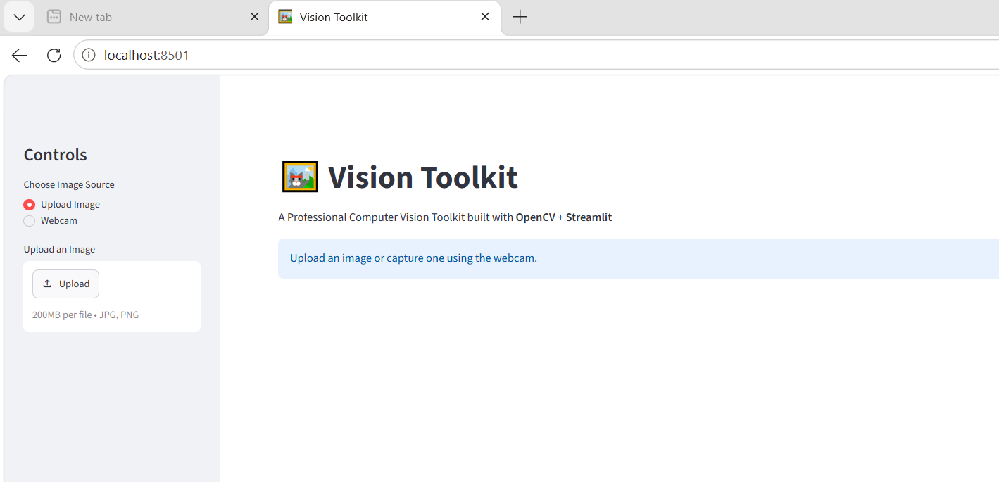
</p>

<p align="center">
  <strong>Interactive Computer Vision and Image Processing Web Application</strong>
</p>

---

## 👩‍💻 Student Information

| Field | Details |
|---|---|
| **Name** | Ayesha Imran |
| **University** | The University of Faisalabad |
| **Degree Program** | Bachelor of Artificial Intelligence |
| **Fellowship** | AI Summer Fellowship 2026 |
| **Track** | Computer Vision Engineering |
| **Week** | Week 1 |
| **Project** | Vision Toolkit |

---

# 📌 Project Overview

**Vision Toolkit** is an interactive computer vision web application developed using **Python, OpenCV, NumPy, Matplotlib, Pillow, and Streamlit**.

The application provides a user-friendly interface for performing fundamental image processing and computer vision operations.

Users can upload an image, inspect image properties, apply image-processing techniques, perform drawing operations, visualize image information, and save or download processed results. Webcam capture is also included as part of the toolkit.

This project was developed as part of the **AI Summer Fellowship 2026 — Week 1 Computer Vision Track** to build a strong engineering foundation in computer vision, image processing, Python development, and software engineering.

---

# 🎯 Objectives

The main objectives of this project are:

- Understand digital image fundamentals
- Learn practical OpenCV operations
- Build an interactive computer vision application
- Implement common image-processing techniques
- Understand image preprocessing
- Implement edge detection and thresholding
- Perform image enhancement and transformations
- Implement basic drawing functions
- Visualize image histograms
- Practice Python modular programming
- Use Git and GitHub for version control
- Develop professional technical documentation

---

# ✨ Features

## 📥 Image Input

- Image Upload
- Webcam Capture

## 📊 Image Information

The application provides:

- Width
- Height
- Resolution
- File Size
- Color Channels

## 🎨 Image Processing

- Grayscale Conversion
- Canny Edge Detection
- Adjustable Canny Thresholds
- Gaussian Blur
- Median Blur
- Binary Threshold
- Adaptive Threshold
- Otsu Threshold

## 🔧 Image Enhancement

- Brightness Adjustment
- Contrast Adjustment
- Image Rotation
- Image Resize
- Image Cropping

## ✏️ Drawing Tools

- Draw Rectangle
- Draw Circle
- Draw Line
- Add Text

## 📈 Visualization

- Histogram Visualization
- Original Image Display
- Processed Image Display
- Image Information

## 💾 Output

- Processed Image Preview
- Save Processed Image
- Download Processed Image

---

# 🧠 Computer Vision Pipeline

The toolkit follows a practical computer vision workflow:

```text
             USER
               │
               ▼
       IMAGE INPUT
       ┌───────┴───────┐
       │               │
 Image Upload     Webcam Capture
       │               │
       └───────┬───────┘
               │
               ▼
       IMAGE PROCESSING
               │
       ┌───────┼────────┐
       │       │        │
   Grayscale  Blur   Edge Detection
       │       │        │
       └───────┼────────┘
               │
               ▼
       IMAGE TRANSFORMATIONS
               │
       ┌───────┼────────┐
       │       │        │
   Threshold Resize    Rotate
       │       │        │
       └───────┼────────┘
               │
               ▼
         VISUALIZATION
               │
               ▼
          FINAL OUTPUT
          ┌────┴────┐
          │         │
         Save    Download
```

---

# 🏗️ Application Architecture

```text
┌──────────────────────┐
│        User          │
└──────────┬───────────┘
           │
           ▼
┌──────────────────────┐
│     Image Input      │
│                      │
│ • Image Upload       │
│ • Webcam Capture     │
└──────────┬───────────┘
           │
           ▼
┌──────────────────────┐
│  OpenCV Processing   │
│                      │
│ • Grayscale          │
│ • Blur               │
│ • Canny              │
│ • Thresholding       │
│ • Transformations    │
│ • Drawing            │
└──────────┬───────────┘
           │
           ▼
┌──────────────────────┐
│    Visualization     │
│                      │
│ • Original Image     │
│ • Processed Image    │
│ • Histogram          │
│ • Image Information  │
└──────────┬───────────┘
           │
           ▼
┌──────────────────────┐
│       Output         │
│                      │
│ • Save               │
│ • Download           │
└──────────────────────┘
```

---

# 🛠️ Technologies Used

| Technology | Purpose |
|---|---|
| **Python 3.11+** | Core programming language |
| **OpenCV** | Computer vision and image processing |
| **NumPy** | Numerical operations and image arrays |
| **Matplotlib** | Histogram visualization |
| **Pillow** | Image handling |
| **Streamlit** | Interactive web application |
| **Git** | Version control |
| **GitHub** | Repository management |
| **VS Code** | Development environment |
| **Jupyter Notebook** | OpenCV experiments |

---

# 📂 Project Structure

```text
CV-VISIONTOOLKIT/
│
├── app.py
├── drawing_tools.py
├── image_processing.py
├── requirements.txt
├── Installation_Guide.md
├── README.md
├── .gitignore
│
├── documentation/
│   ├── Architecture_Documentation.md
│   ├── Builder_Journal.md
│   └── Research_Report.md
│
├── Experiments/
│   └── OpenCV Experiments Notebook
│
└── screenshots/
    ├── 01_python_version.png
    ├── 02_git_version.png
    ├── 03_vscode_project.png
    ├── 04_github_repository.png
    ├── 05_home_screen.png
    ├── 06_upload_image.png
    ├── 07_grayscale.png
    ├── 08_gaussian_blur.png
    ├── 09_brightness.png
    ├── 10_circle.png
    ├── 11_project_structure.png
    ├── home.png
    └── image detection.png
```

---

# ⚙️ Installation

## 1. Clone the Repository

```bash
git clone https://github.com/AyeshaImran-61/Computer-Vision-Fellowship-2026.git
```

## 2. Navigate to the Project

```bash
cd Computer-Vision-Fellowship-2026
```

## 3. Create a Virtual Environment

```bash
python -m venv .venv
```

## 4. Activate the Virtual Environment

### Windows

```bash
.venv\Scripts\activate
```

## 5. Install Dependencies

```bash
pip install -r requirements.txt
```

## 6. Run the Application

```bash
streamlit run app.py
```

The application will normally be available at:

```text
http://localhost:8501
```

For the complete setup procedure, see **Installation_Guide.md**.

---

# 📦 Requirements

The main project dependencies are:

```text
streamlit
opencv-python
numpy
matplotlib
pillow
```

The complete dependency list is maintained in:

`requirements.txt`

---

# 📸 Application Screenshots

## 🏠 Home Screen

The main Vision Toolkit interface provides access to the application's image-processing features.

<p align="center">
  
</p>

---

## 📤 Image Upload

Users can upload an image to begin processing and analysis.

<p align="center">
  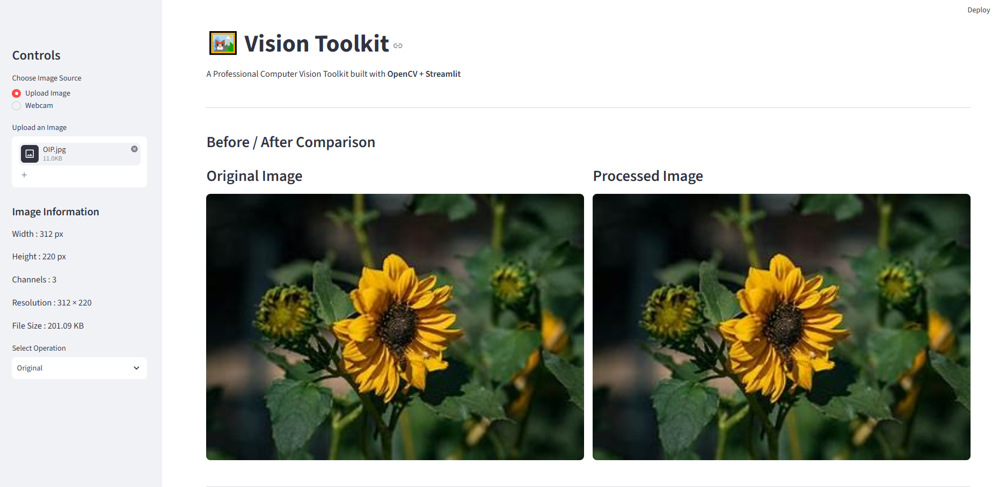
</p>

---

## ⚫ Grayscale Conversion

The uploaded image can be converted from a color image into grayscale using OpenCV.

<p align="center">
  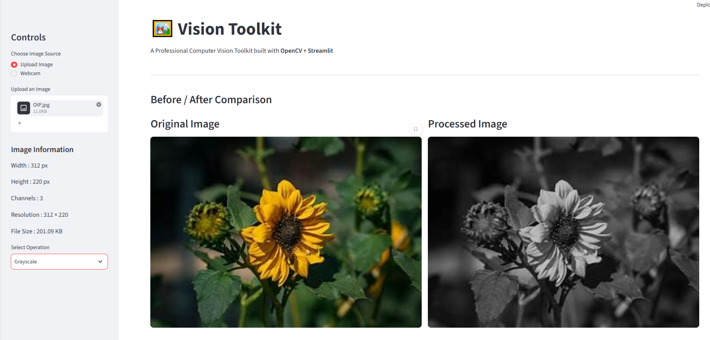
</p>

---

## 🌫️ Gaussian Blur

Gaussian Blur smooths the image and helps reduce noise before further processing.

<p align="center">
  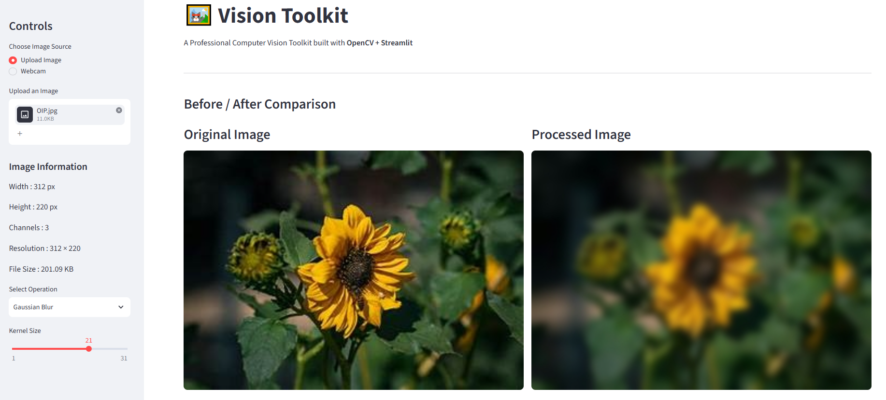
</p>

---

## ☀️ Brightness Adjustment

Brightness adjustment allows the user to modify the intensity of the image.

<p align="center">
  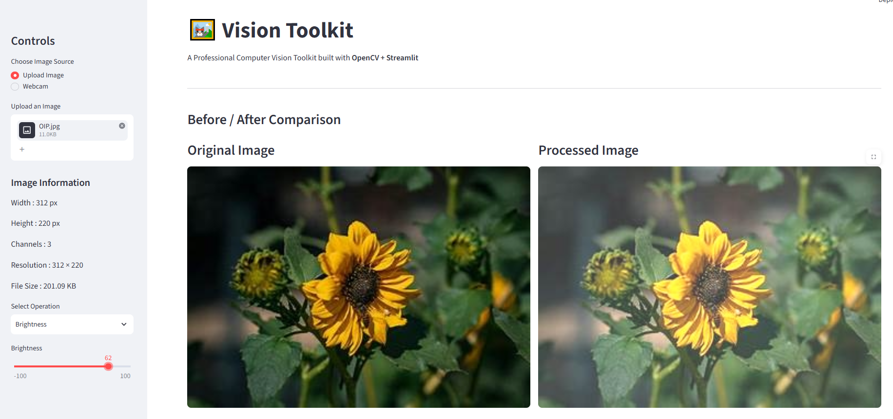
</p>

---

## ⭕ Drawing Tools

The drawing functionality allows geometric shapes to be added to an image.

<p align="center">
  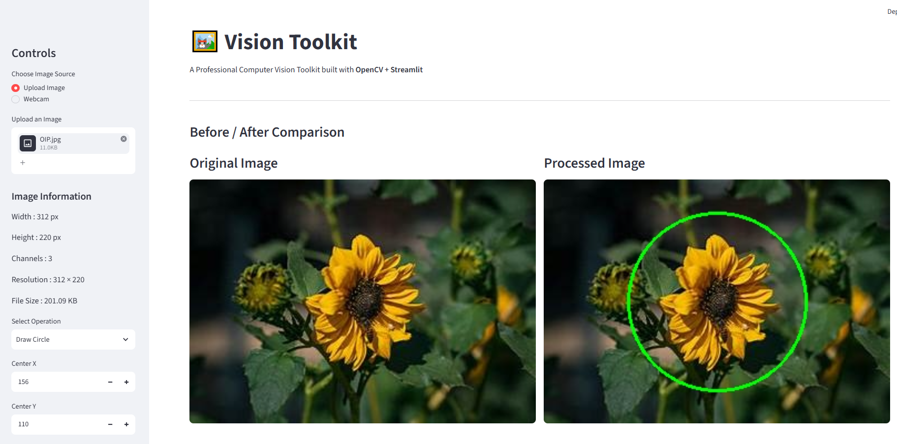
</p>

---

# 🖥️ Development Environment Screenshots

## 🐍 Python Installation

Python version verification used during the development environment setup.

<p align="center">
  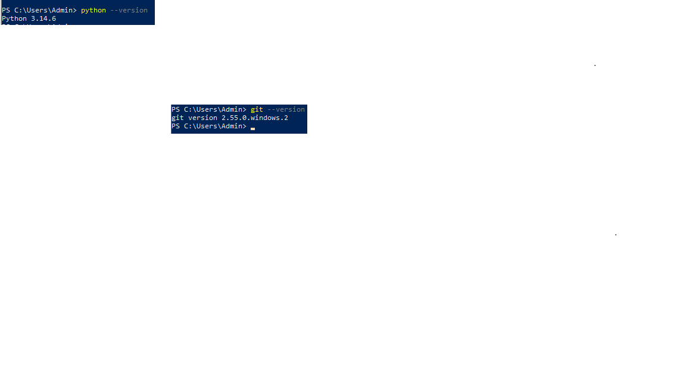
</p>

---

## 🔧 Git Installation

Git version verification.

<p align="center">
  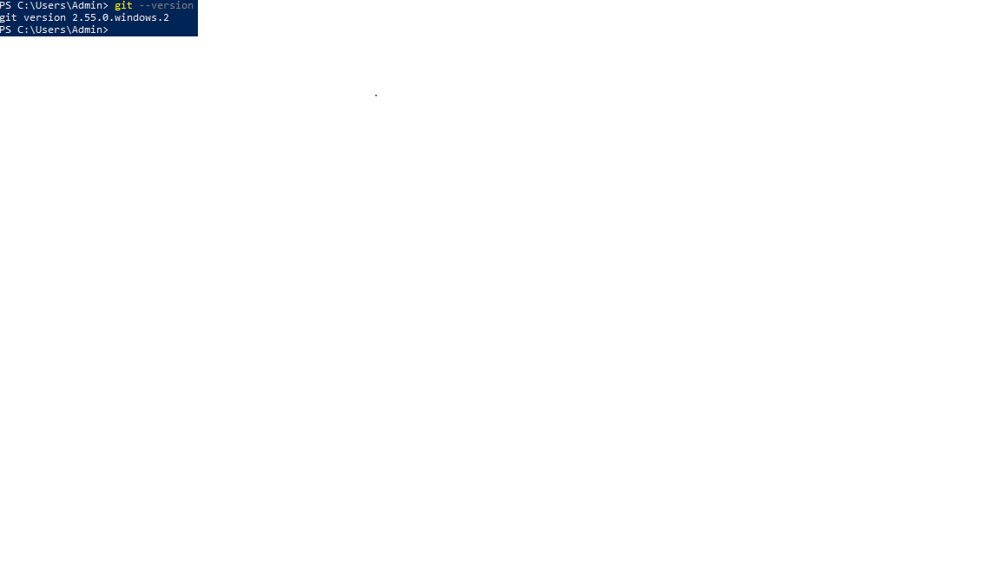
</p>

---

## 💻 VS Code Project

The Vision Toolkit was developed and organized using Visual Studio Code.

<p align="center">
  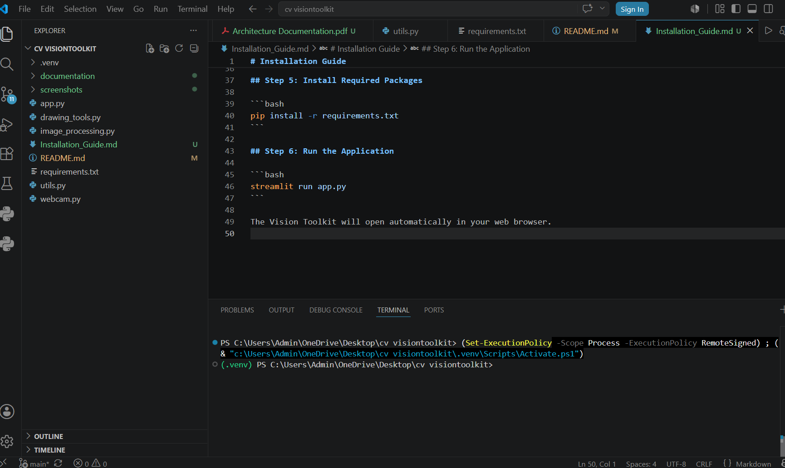
</p>

---

## 🌐 GitHub Repository

The project source code and documentation are maintained using GitHub.

<p align="center">
  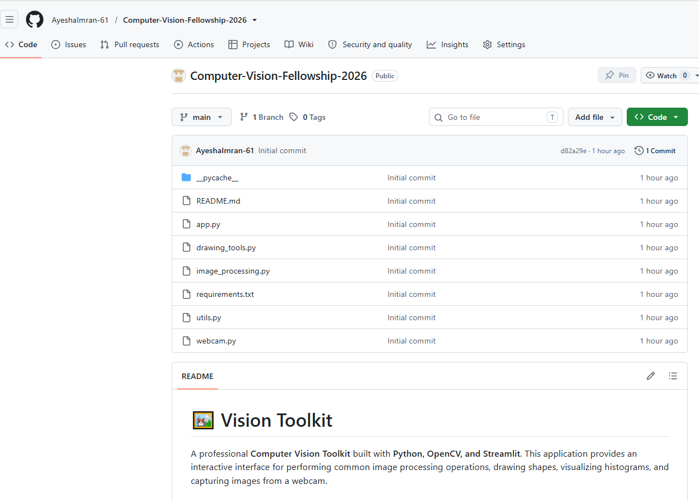
</p>

---

## 📁 Final Project Structure

The project structure contains the source code, documentation, experiments, requirements, and screenshots.

<p align="center">
  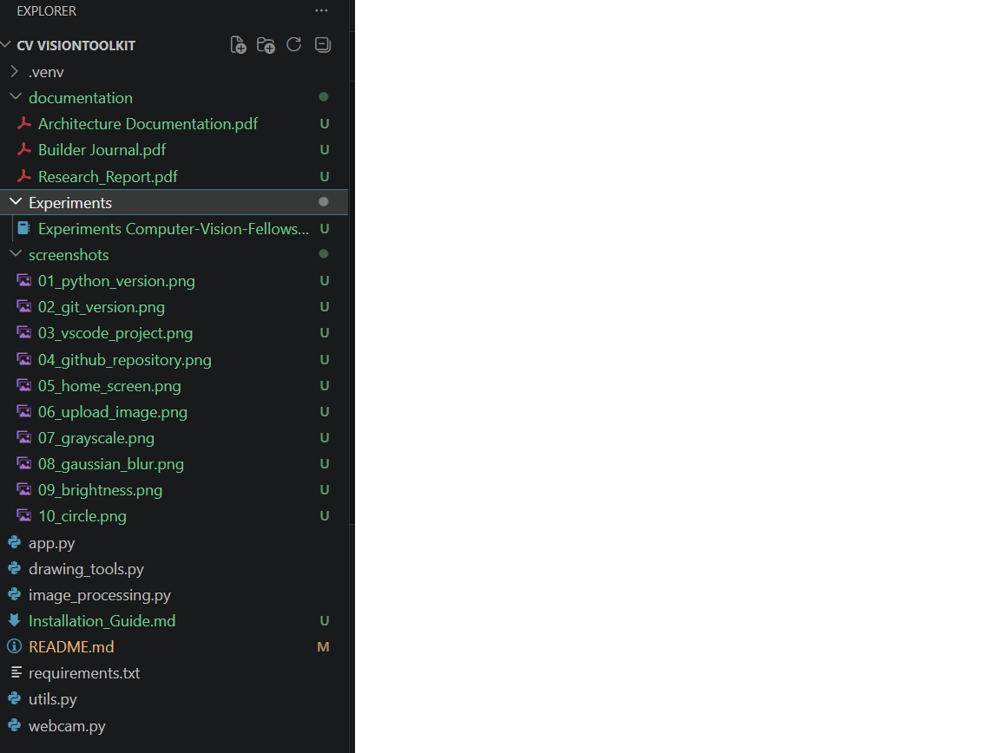
</p>

---

# 🧪 OpenCV Experiments

The project includes a Jupyter Notebook demonstrating five fundamental OpenCV experiments.

## Experiment 1 — Color Space Conversion

Demonstrates image color representations and conversion between:

- RGB
- Grayscale
- HSV

## Experiment 2 — Image Filtering

Demonstrates:

- Gaussian Blur
- Median Blur
- Image smoothing
- Noise reduction

## Experiment 3 — Edge Detection

Demonstrates:

- Canny Edge Detection
- Edge extraction

## Experiment 4 — Contour Detection

Demonstrates:

- Contour extraction
- Object boundaries
- Contour visualization

## Experiment 5 — Shape Detection

Demonstrates:

- Basic shape detection
- Geometric features
- Shape analysis

The notebook is located inside the `Experiments` folder.

---

# 📚 Documentation

The repository contains the required Week 1 documentation.

## 📄 Research Report

### The Modern Computer Vision Pipeline

The report covers:

- Image Acquisition
- Image Processing
- Object Detection
- Classification
- Segmentation
- Tracking
- Deployment
- Real-world Computer Vision examples

**File:** `documentation/Research_Report.md`

---

## 🏗️ Architecture Documentation

The architecture document explains:

- User interaction
- Image input
- OpenCV processing
- Visualization
- Output
- Application data flow

**File:** `documentation/Architecture_Documentation.md`

---

## 📔 Builder Journal

The Builder Journal covers:

- Why Computer Vision was selected
- Areas of interest
- Week 1 learning
- Biggest development challenge
- How the challenge was solved
- Goals for Week 2

**File:** `documentation/Builder_Journal.md`

---

## 📘 Installation Guide

The installation guide documents the development environment setup, dependencies, virtual environment, and application execution.

**File:** `Installation_Guide.md`

---

# 🧪 Testing

The main application features were tested during development.

| Feature | Status |
|---|---|
| Image Upload | ✅ |
| Image Information | ✅ |
| Grayscale Conversion | ✅ |
| Canny Edge Detection | ✅ |
| Canny Threshold Adjustment | ✅ |
| Gaussian Blur | ✅ |
| Median Blur | ✅ |
| Binary Threshold | ✅ |
| Adaptive Threshold | ✅ |
| Otsu Threshold | ✅ |
| Rectangle Drawing | ✅ |
| Circle Drawing | ✅ |
| Line Drawing | ✅ |
| Text Overlay | ✅ |
| Histogram | ✅ |
| Brightness Adjustment | ✅ |
| Contrast Adjustment | ✅ |
| Image Rotation | ✅ |
| Image Resize | ✅ |
| Image Cropping | ✅ |
| Webcam Capture | ✅ |
| Image Download | ✅ |

---

# 🔬 Technical Concepts

## Pixel

A pixel is the smallest unit of a digital image that contains color or intensity information.

## Resolution

Resolution describes the dimensions of an image in pixels.

```text
Resolution = Width × Height
```

## RGB

RGB represents an image using three color channels:

- Red
- Green
- Blue

## Grayscale

A grayscale image represents intensity using a single channel instead of three RGB channels.

## Gaussian Blur

Gaussian Blur smooths an image and reduces high-frequency noise.

## Median Blur

Median filtering reduces noise while helping preserve important edges.

## Canny Edge Detection

Canny Edge Detection identifies significant intensity changes in an image to detect edges and object boundaries.

## Thresholding

Thresholding separates pixels according to their intensity values and is commonly used to create binary images.

## Contours

Contours represent boundaries of objects or regions in an image.

---

# 📈 Learning Outcomes

Through this project, I developed practical understanding of:

- Digital image representation
- Pixels and resolution
- RGB and grayscale images
- Color channels
- Image formats
- OpenCV fundamentals
- NumPy image arrays
- Image filtering
- Noise reduction
- Canny Edge Detection
- Thresholding
- Contour detection
- Shape detection
- Image transformations
- Drawing operations
- Histogram visualization
- Streamlit application development
- Python modular programming
- Git and GitHub
- Technical documentation

---

# 🚀 Deployment

The Vision Toolkit is designed as a **Streamlit web application** and can be deployed using **Streamlit Community Cloud**.

The main application file is:

```text
app.py
```

The required Python packages are specified in:

```text
requirements.txt
```

No live demo URL is included in this README.

---

# 🔮 Future Improvements

The current project focuses on fundamental computer vision and image processing. Future versions can include:

- Real-Time Object Detection
- YOLO Integration
- Face Detection
- Object Tracking
- Image Segmentation
- Video Processing
- Real-Time Video Analytics
- Deep Learning Models
- Automated Object Counting

These improvements provide a natural progression from traditional image processing toward advanced AI-based computer vision systems.

---

# 🏆 Week 1 Submission Status

| Requirement | Status |
|---|---|
| Development Environment | ✅ Completed |
| Professional GitHub Setup | ✅ Completed |
| Technical Research Report | ✅ Completed |
| Vision Toolkit Application | ✅ Completed |
| OpenCV Experiments | ✅ Completed |
| Architecture Documentation | ✅ Completed |
| Builder Journal | ✅ Completed |
| Installation Guide | ✅ Completed |
| Screenshots | ✅ Completed |
| GitHub Repository | ✅ Completed |
| Streamlit Deployment | 🔄 In Progress |
| Demo Video | 🔄 In Progress |

---

# 👩‍💻 Author

## Ayesha Imran

**Bachelor of Artificial Intelligence**  
**The University of Faisalabad**

**AI Summer Fellowship 2026**  
**Computer Vision Engineering Track**

---

<p align="center">
  <strong>AI Summer Fellowship 2026 — Week 1</strong>
</p>

<p align="center">
  Built with Python • OpenCV • NumPy • Matplotlib • Pillow • Streamlit
</p>
